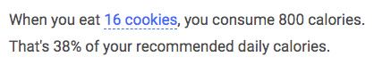

# Ink Components

[](https://www.npmjs.com/package/ink-components)
[](https://github.com/ink-components/ink-components/blob/master/LICENSE)
[](https://www.webcomponents.org/element/ink-components)


The goal of [ink-components](https://components.ink) is to provide web-components for interactive scientific writing, reactive documents and [explorable explanations](https://explorabl.es).
Included in [ink-components](https://components.ink) are ways to create, update and display variables as text, equations and charts.

The [ink-components](https://components.ink) project is heavily inspired by [tangle.js](http://worrydream.com/Tangle/guide.html), re-imagined to use [web-components](https://www.webcomponents.org/)!
This means you can declaratively write your variables and how to display them in `html` markup.
To get an idea of what that looks like, let's take the canonical example of *Tangled Cookies* - a simple reactive document.



```html
<ink-var name="cookies" value="3" format=".4"></ink-var>
<ink-var name="caloriesPerCookie" value="50"></ink-var>
<ink-var name="dailyCalories" value="2100"></ink-var>

<ink-var name="calories" :value="cookies * caloriesPerCookie" format=".0f"></ink-var>
<ink-var name="dailyPercent" :value="calories / dailyCalories" format=".0%"></ink-var>

<p>
    When you eat <ink-dynamic name="cookies" min="2" max="100"> cookies</ink-dynamic>,
    you consume <ink-display name="calories"></ink-display> calories.<br>
    That's <ink-display name="dailyPercent"></ink-display> of your recommended daily calories.
</p>
```

## Getting Started

Ink is based on web-components, which creates custom HTML tags so that they can make writing documents easier.
To get started, copy the built javascript file to the head of your page:

```html
<script src="https://unpkg.com/ink-components"></script>
```

You can also download the [latest release](https://github.com/ink-components/ink-components/releases) from GitHub. If you are running this without a web server, ensure the script has `charset="utf-8"` in the script tag. You can also [install from npm](https://www.npmjs.com/package/ink-components):

```bash
>> npm install ink-components
```

You should then be able to extend ink as you see fit:

```javascript
import * as ink from 'ink-components';
```

## Components

* Variables, actions and displays
    * [ink-scope](https://www.webcomponents.org/element/ink-components/elements/ink-scope)
    * [ink-var](https://www.webcomponents.org/element/ink-components/elements/ink-var)
    * [ink-var-list](https://www.webcomponents.org/element/ink-components/elements/ink-var-list)
    * [ink-display](https://www.webcomponents.org/element/ink-components/elements/ink-display)
    * [ink-range](https://www.webcomponents.org/element/ink-components/elements/ink-range)
    * [ink-dynamic](https://www.webcomponents.org/element/ink-components/elements/ink-dynamic)
    * [ink-button](https://www.webcomponents.org/element/ink-components/elements/ink-button)
    * [ink-action](https://www.webcomponents.org/element/ink-components/elements/ink-action)
* Charts
    * [ink-chart](https://www.webcomponents.org/element/ink-components/elements/ink-chart)
    * [ink-chart-circle](https://www.webcomponents.org/element/ink-components/elements/ink-chart-circle)
    * [ink-chart-path](https://www.webcomponents.org/element/ink-components/elements/ink-chart-path)
    * [ink-chart-text](https://www.webcomponents.org/element/ink-components/elements/ink-chart-text)
    * [ink-chart-node](https://www.webcomponents.org/element/ink-components/elements/ink-chart-node)
    * [ink-chart-eqn](https://www.webcomponents.org/element/ink-components/elements/ink-chart-eqn)
* Simple layout
    * [ink-article](https://www.webcomponents.org/element/ink-components/elements/ink-article)
    * [ink-equation](https://www.webcomponents.org/element/ink-components/elements/ink-equation)
    * [ink-figure](https://www.webcomponents.org/element/ink-components/elements/ink-figure)
    * [ink-code](https://www.webcomponents.org/element/ink-components/elements/ink-code)
    * [ink-demo](https://www.webcomponents.org/element/ink-components/elements/ink-demo)
    * [ink-outline](https://www.webcomponents.org/element/ink-components/elements/ink-outline)
    * [ink-aside](https://www.webcomponents.org/element/ink-components/elements/ink-aside)
    * [ink-callout](https://www.webcomponents.org/element/ink-components/elements/ink-callout)
    * [ink-quote](https://www.webcomponents.org/element/ink-components/elements/ink-quote)
    * [ink-card](https://www.webcomponents.org/element/ink-components/elements/ink-card)
    * [ink-byline](https://www.webcomponents.org/element/ink-components/elements/ink-byline)
    * [h2-more](https://www.webcomponents.org/element/ink-components/elements/h2-more)
    * [ink-span](https://www.webcomponents.org/element/ink-components/elements/ink-span)
    * [ink-p](https://www.webcomponents.org/element/ink-components/elements/ink-p)
    * [ink-div](https://www.webcomponents.org/element/ink-components/elements/ink-div)
    * [ink-a](https://www.webcomponents.org/element/ink-components/elements/ink-a)
* Resume elements
    * [cv-item](https://www.webcomponents.org/element/ink-components/elements/cv-item)
    * [cv-award](https://www.webcomponents.org/element/ink-components/elements/cv-award)

